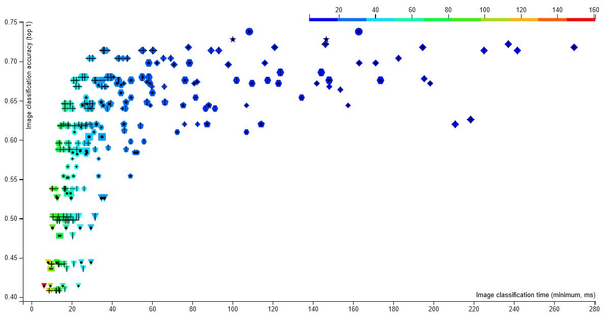
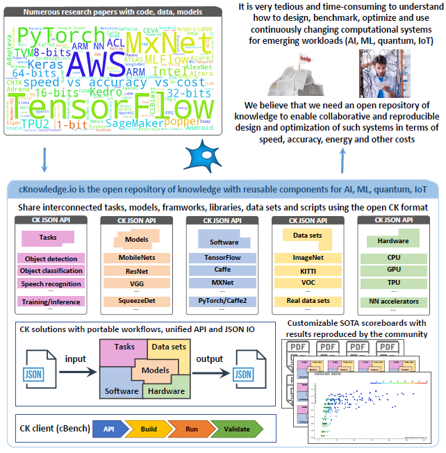

# CK basics

## Why CK?

While working in large R&D projects with multiple partners to design efficient machine learning systems, 
we face the same problems over and over again:

* When we find an interesting GitHub project, a Jupyter/Colab notebook, or a Docker file from a research paper,
  we want to test it with different data, models, libraries, and AI frameworks.
  We may also want to compare it with another project or integrate it with some continuous integration service,
  or even rebuild it with a different compiler to run on a different hardware.
  However, we quickly get lost in the structure of the project, scripts, and APIs,
  and spend too much time trying to figure out how to make it compatible with different software and hardware, 
  and how to plug in different datasets and models
  while correctly setting up numerous paths and variables. 
  Eventually, we either give up or we manage to customize and run it 
  but then we often struggle to reproduce and compare results (speed, throughput, accuracy, energy, costs).
  By that time, we most likely have to look at another project while facing the same problems again.

* We want to reuse some data, code, and models from our own project or from the project we participated in a few years ago,
  but we already forgot the details and scripts while the readme files and comments are too vague,
  our colleagues or students have left the project, and we either give up 
  or start reimplementing everything from scratch.

Eventually, we realized that a possible solution is to organize software projects and folders as a sort of database
of components (algorithms, datasets, models, frameworks, scripts, results from experiments, papers, etc) 
with extensible JSON meta descriptions. 
In such case we can have a simple tool to automatically find all related components 
from all projects. We can also implement common automation actions for related components 
that can be reused across different projects due to a unified API and CLI.
We can even implement workflows from these actions that can automatically 
find and plug in all related components from all compatible projects thus
minimizing manual interventions and providing a common interface for all shared projects and components.

We called this project Collective Knowledge (CK) because it helps users share their knowledge, experience,
and best practices as reusable automation actions and components with a common API and meta description.
Interestingly, the CK concept enables FAIR principles (findability, accessibility, interoperability, and reusability)
published in this [Nature article](https://www.nature.com/articles/sdata201618).


## What is CK?

We have developed the [Collective Knowledge framework (CK)](https://github.com/ctuning/ck) 
as a small Python library with a unified command line interface (CLI).
CK provides commands to organize new software projects or rearrange existing ones
as a ***CK repository*** - a human-readable database 
of reusable ***CK components***. 
Such components wrap user artifacts and provide an extensible JSON meta description
and [common automation actions](https://cKnowledge.io/actions) with a unified API, CLI and JSON input/output.
You can find a partial list of shared CK repositories at [cKnowledge.io/repos]( https://cKnowledge.io/repos ).

Since we want CK to be non-intrusive and technology neutral, we use a simple 2-level directory structure
to wrap user artifacts into CK components. We also use ``.cm`` directories (similar to ``.git``)
to store meta information of all components including automatically assigned Unique IDs (***CK UID***):


The root directory of the CK repository contains ``.ckr.json`` to describe this repository 
and specify dependencies on other CK repositories to reuse their components and automation actions. 
The root also contains directories to group related components together such as a ``dataset`` or ``program`` 
(***CK component type***). 
Finally, the root directory contains ``.cm`` directory that keeps Unique IDs of all components
to be able to keep track of all created components even if their names have changed (***CK alias***).

The second directory level (``CK entries`` or ``CK data``) is used to store artifacts (any files and sub-directories) 
for components such as ``dataset/text1234-for-nlp`` or ``dataset/some-images-from-imagenet``. 
Each such sub-directory also contains ``.cm`` directory with a ``meta.json`` file to describe a given component
and a ``info.json`` file to keep the provenance of a given component
including copyrights, licenses, creation date, contributors and so on.

Each ***CK component type*** must have a related ***CK module*** 
with the same name (for example ``dataset`` or ``program``) 
that contains a simple Python module with common automation actions for a given component type
such as ``compile program`` or ``run program``.
These modules are also stored as CK entries in CK repositories
such as ``module/dataset/module.py`` or ``module/program/module.py``.
Such approach allows multiple users to add, improve, and reuse
common automation action for related components rather than
reimplementing them from scratch for each new project.

Note that CK framework has an internal [***default CK repository***]( https://github.com/ctuning/ck/tree/master/ck/repo ) 
with stable [***CK modules***](https://github.com/ctuning/ck/tree/master/ck/repo/module) and most commonly used automation actions.
When CK is used for the first time, it also creates a ***local CK repository***
in the user space to be used as a working repository or a scratch-pad.

CK provides a simple command line interface similar natural language to manage CK repositories, entries, and actions:
```bash
ck <action> <CK module name> (flags) (@input.json)
ck <action> <CK module name>:<CK entry name> (flags) (@input.json)
ck <action> <CK repository name>:<CK module name>:<CK entry name>
```

For example:

```bash
pip install ck

ck pull repo --url=https://github.com/ctuning/ck-crowdtuning

ck compile program:cbench-automotive-susan --speed
ck run program:cbench-automotive-susan --env.OMP_NUM_THREADS=4

ck cp program:cbench-automotive-susan program:cbench-automotive-susan-copy

```

CK also provides a Python library with a simple API that can be easily used in web applications or continuous integration services:
```python
import ck.kernel as ck

# Equivalent of "ck compile program:cbench-automotive-susan --speed"
r=ck.access({'action':'compile', 'module_uoa':'program', 'data_uoa':'cbench-automotive-susan', 
             'speed':'yes'})
if r['return']>0: return r # unified error handling 

print (r)

# Equivalent of "ck run program:cbench-automotive-susan --env.OMP_NUM_THREADS=4
r=ck.access({'action':'run', 'module_uoa':'program', 'data_uoa':'cbench-automotive-susan', 
             'env':{'OMP_NUM_THREADS':4}})
if r['return']>0: return r # unified error handling 

print (r)

```


Based on the feedback from our users, we have recently developed an open ***CK platform***
to help the community share CK components, create live scoreboards,
and participate in collaborative experiments: [https://cKnowledge.io](cKnowledge.io).

* We suggest you to read this [nice blog post](https://michel.steuwer.info/About-CK/) from Michel Steuwer about CK basics!
* You can find a partial list of CK-compatible repositories at [cKnowledge.io/repos](https://cKnowledge.io/repos).


## How CK supports collaborative and reproducible ML&systems research

It is a very tedious, ad-hoc, and time consuming process to design complex computational systems 
that can run AI, ML, and other emerging workloads in the most efficient way 
due to continuously changing software, hardware, models, data sets, and research techniques.

The first reason why we have developed CK was to connect our colleagues, students, researchers, and engineers
from different workgroups to collaboratively solve these problems and decompose complex systems and research projects
into [reusable, portable, customizable, and non-virtualized CK components](https://cKnowledge.io/browse)
with unified [automation actions, Python APIs, CLI, and JSON meta description](https://cKnowledge.io/actions).

We used CK as a common playground to prototype and test different abstractions and automations of many ML&systems tasks
in collaboration with our great [academic and industrial partners](https://cKnowledge.io/partners)
while agreeing on APIs and meta descriptions of all components.
Over years the project grew from several core CK modules and abstractions 
to [150+ CK modules](https://cKnowledge.io/modules) with [600+ actions](https://cknowledge.io/actions)
automating typical, repetitive, and tedious tasks from ML&systems R&D.
See this [fun video](https://youtu.be/nabXHyot5is) 
and the [knowledge graph](https://cKnowledge.io/kg1) 
showing the evolution of CK over time.


For example, CK now features actions for 
[software detection](https://cKnowledge.io/soft), 
[package installation](https://cKnowledge.io/packages) 
and [platform/OS detection](https://cKnowledge.io/c/os)
to automate the detection and installation of [all the dependencies](https://cknowledge.io/c/solution/mlperf-inference-v0.5-detection-openvino-ssd-mobilenet-coco-500-linux/#dependencies) 
including data sets and models required by different research projects.

Thanks to unified automation actions, APIs, and JSON meta descriptions of such components,
we could apply the DevOps methodology to connect them
into platform-agnostic, portable, customizable, and reproducible
[program pipelines (workflows)](https://cKnowledge.io/programs).
Such workflows can automatically adapt to evolving environments, models, data sets, and non-virtualized platforms
by automatically detecting the properties of a target platform,
finding all required components on a user platform using [CK software detection plugins](https://cKnowledge.io/soft)
based on the list of [all dependencies](https://cknowledge.io/solution/demo-obj-detection-coco-tf-cpu-benchmark-linux-portable-workflows/#dependencies),
installing missing components using [portable CK meta packages](https://cKnowledge.io/packages),
building and running code, and unifying and testing outputs.

Eventually, CK helped to connect researchers and practitioners to collaboratively co-design, benchmark, optimize, and validate 
novel AI, ML, and quantum techniques using the [open repository of knowledge](https://cKnowledge.io)
with [live SOTA scoreboards](https://cKnowledge.io/sota)
and [reproducible papers](https://cKnowledge.io/reproduced-papers).
Such scoreboards can be used to find and rebuild the most efficient AI/ML/SW/HW stacks
on a [Pareto frontier](https://cKnowledge.org/request)
across diverse platforms from supercomputers to edge devices
while trading off speed, accuracy, energy, size, and different costs.
Stable and optimized CK workflows can be then deployed inside Docker and Kubernetes 
to simplify the integration and adoption of innovative technology in production.



Our goal is to use the CK technology to bring DevOps principles to ML&systems R&D,
make it more collaborative, reproducible, and reusable, 
enable portable MLOps, and make it possible to understand [what happens]( https://cknowledge.io/solution/demo-obj-detection-coco-tf-cpu-benchmark-linux-portable-workflows/#dependencies ) 
inside complex and "black box" computational systems.

Our dream is to see portable workflows shared along with new systems, algorithms, and [published research techniques](https://cKnowledge.io/events)
to be able to quickly test, reuse and compare them across different data sets, models, software, and hardware!
That is why we support related reproducibility and benchmarking initiatives
including [artifact evaluation](https://cTuning.org/ae), 
[MLPerf](https://mlperf.org), [PapersWithCode](https://paperswithcode.com),
and [ACM artifact review and badging](https://www.acm.org/publications/policies/artifact-review-badging).




You can learn more about the CK project from [CK presentations and white papers](https://github.com/ctuning/ck/wiki/Publications).

*Even though the CK technology is used [in production](https://cKnowledge.org/partners.html) for more than 5 years,
it is still a proof-of-concept prototype requiring further improvements
and standardization. Depending on the available resources, we plan
to develop a new, backward-compatible and more user-friendly version - please [get in touch](https://cKnowledge.org/contacts.html) if you are
interested to know more!*


## CK platform


* [cKnowledge.io](https://cKnowledge.io): the open portal with stable CK components, workflows, reproduced papers, and SOTA scoreboards for complex computational systems (AI,ML,quantum,IoT):
  * [**Browse all CK ML&systems components**](https://cknowledge.io/?q=mlsystems)
  * [Browse CK compatible repositories]( https://cknowledge.io/repos )
  * [Browse SOTA scoreboards powered by CK workflows](https://cKnowledge.io/reproduced-results)
  * [Browse all shared CK components](https://cKnowledge.io/browse)
* [Check documentation](https://cKnowledge.io/docs)
* [Our reproducibility initiatives for systems and ML conferences](https://cTuning.org/ae)


## CK-powered workflows, automation actions, and reusable artifacts for ML&systems R&D

* [Real-world use-cases](https://cKnowledge.org/partners)
* Reproducibility initiatives: [[methodology](https://cTuning.org/ae)], [[events](https://cKnowledge.io/events)]
* Showroom (public projects powered by CK):
  * [MLPerf automation](https://github.com/ctuning/ck-mlperf)
  * Student Cluster Competition automation: [SCC18](https://github.com/ctuning/ck-scc18), [digital artifacts](https://github.com/ctuning/ck-scc)
  * ML-based autotuning project: [reproducible paper demo](https://cKnowledge.io/report/rpi3-crowd-tuning-2017-interactive),  [MILEPOST]( https://github.com/ctuning/reproduce-milepost-project )
  * Stable Docker containers with CK workflows: [MLPerf example](https://cknowledge.io/c/docker/mlperf-inference-vision-with-ck.intel.ubuntu-18.04/), [cKnowledge.io]( https://cKnowledge.io/c/docker ), [Docker Hub](https://hub.docker.com/u/ctuning)
  * [Quantum hackathons](https://cKnowledge.org/quantum)
  * [ACM SW/HW co-design tournaments for Pareto-efficient deep learning](https://cKnowledge.org/request)
  * Portable CK workflows and components for:
    * [TensorFlow](https://github.com/ctuning/ck-tensorflow)
    * [PyTorch](https://github.com/ctuning/ck-pytorch)
    * [TensorRT](https://github.com/ctuning/ck-tensorrt)
    * [OpenVino](https://github.com/ctuning/ck-openvino)
    * [individual NN operators](https://github.com/ctuning/ck-nntest)
    * [object detection](https://github.com/ctuning/ck-object-detection)
  * [GUI to automate  ML/SW/HW benchmarking with MLPerf example (under development)](https://cKnowledge.io/test)
  * [Reproduced papers]( https://cKnowledge.io/reproduced-papers )
  * [Live scoreboards for reproduced papers]( https://cKnowledge.io/reproduced-results )
* Examples of CK components (automations, API, meta descriptions):
    * *program : image-classification-tflite-loadgen* [[cKnowledge.io]( https://cKnowledge.io/c/program/image-classification-tflite-loadgen )] [[GitHub]( https://github.com/ctuning/ck-mlperf/tree/master/program/image-classification-tflite-loadgen )]
    * *program : image-classification-tflite* [[GitHub](https://github.com/ctuning/ck-tensorflow/tree/master/program/image-classification-tflite)]
    * *soft : lib.mlperf.loadgen.static* [[GitHub]( https://github.com/ctuning/ck-mlperf/tree/master/soft/lib.mlperf.loadgen.static )]
    * *package : lib-mlperf-loadgen-static* [[GitHub]( https://github.com/ctuning/ck-mlperf/tree/master/package/lib-mlperf-loadgen-static )]
    * *package : model-onnx-mlperf-mobilenet* [[GitHub]( https://github.com/ctuning/ck-mlperf/tree/master/package/model-onnx-mlperf-mobilenet/.cm )]
    * *package : lib-tflite* [[cKnowledge.io]( https://cKnowledge.io/c/package/lib-tflite )] [[GitHub]( https://github.com/ctuning/ck-tensorflow/tree/master/package/lib-tflite )]
    * *docker : object-detection-tf-py.tensorrt.ubuntu-18.04* [[cKnowledge.io]( https://cknowledge.io/c/docker/object-detection-tf-py.tensorrt.ubuntu-18.04 )]
    * *docker : ** [[GitHub]( https://github.com/ctuning/ck-mlperf/tree/master/docker )]
    * *docker : speech-recognition.rnnt* [[GitHub]( https://github.com/ctuning/ck-mlperf/tree/master/docker/speech-recognition.rnnt )]
    * *package : model-tf-** [[GitHub]( https://github.com/ctuning/ck-object-detection/tree/master/package )]
    * *script : mlperf-inference-v0.7.image-classification* [[cKnowledge.io]( https://cknowledge.io/c/script/mlperf-inference-v0.7.image-classification )]
    * *jnotebook : object-detection* [[GitHub](https://nbviewer.jupyter.org/urls/dl.dropbox.com/s/5yqb6fy1nbywi7x/medium-object-detection.20190923.ipynb)]

[](https://www.youtube.com/watch?v=DIkZxraTmGM)
[](https://www.youtube.com/watch?v=VpedDdia5yY)
